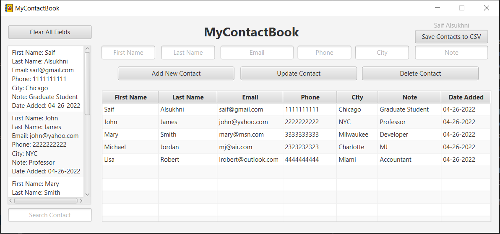

# MyContactBook

MyContactBook is a contact book application featuring a JavaFX GUI.  Contacts can be added, updated, and deleted. All data is stored in a self-contained SQLite database.  This application also uses a Model View Controller (MVC) class structure and design pattern.  The Contact file is the model, the ContactsController is the controller, and Main/ContactBookGUI function as the view.  

MyContactBook uses Timestamp and JavaFX ListView to fulfill the content not covered in class requirement.  Timestamp is used to log when a contact is added.  JavaFX ListView is used to display the list of added contacts.  JavaFX TableView is used to display a sortable list of contacts.  JavaFX Alerts were used to notify the user of successful add, update, or delete actions.  An inner class and lambda expressions are used in the controller (ContactsController) for the events, buttons, and search filter.  The app can also write the Contact list into a CSV file for sharing.

# Contact App Preview

# **App Features**
- Add contacts by filling out empty text boxes and clicking the "Add New Contact Button". A popup will appear after a new contact is added.
- Update or Delete contacts by first selecting them from either the ListView or TableView. Then either make edits in the text fields or delete. A popup will appear after an update or delete.
- Search contacts by typing their first or last name in the "Search Contact" textfield. The ListView and TableView should update automatically with results.
- Sort contacts by specific column using the headers in the table.
- "Clear All Fields" button to clear all text in the textfields.
- "Save Contacts to CSV" will write all contacts to an external CSV file.

# **This application can be started by running the Main.java file.**